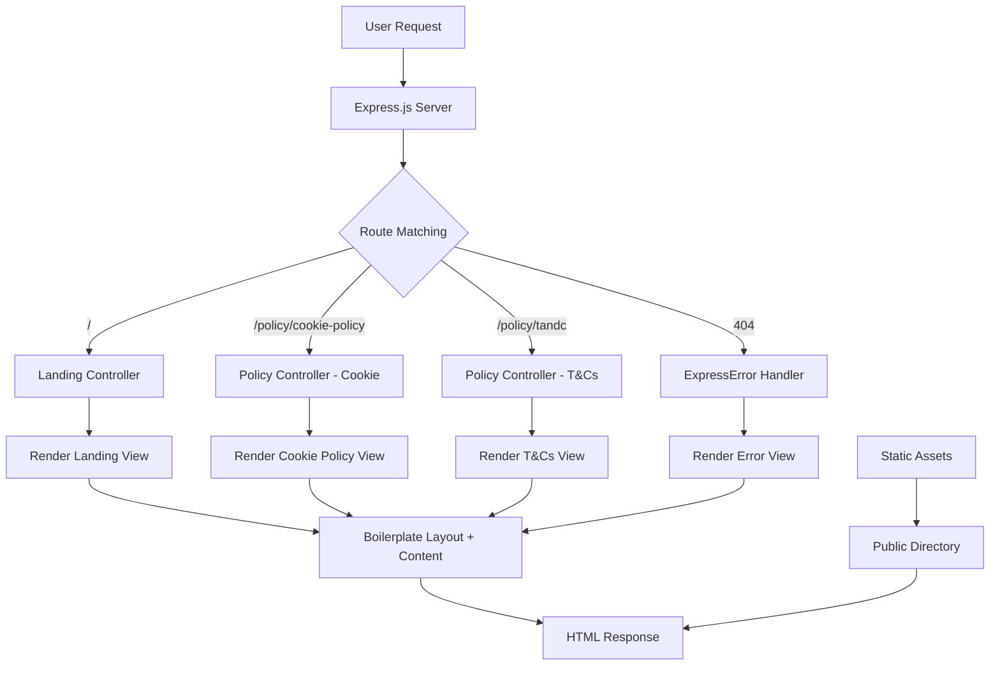
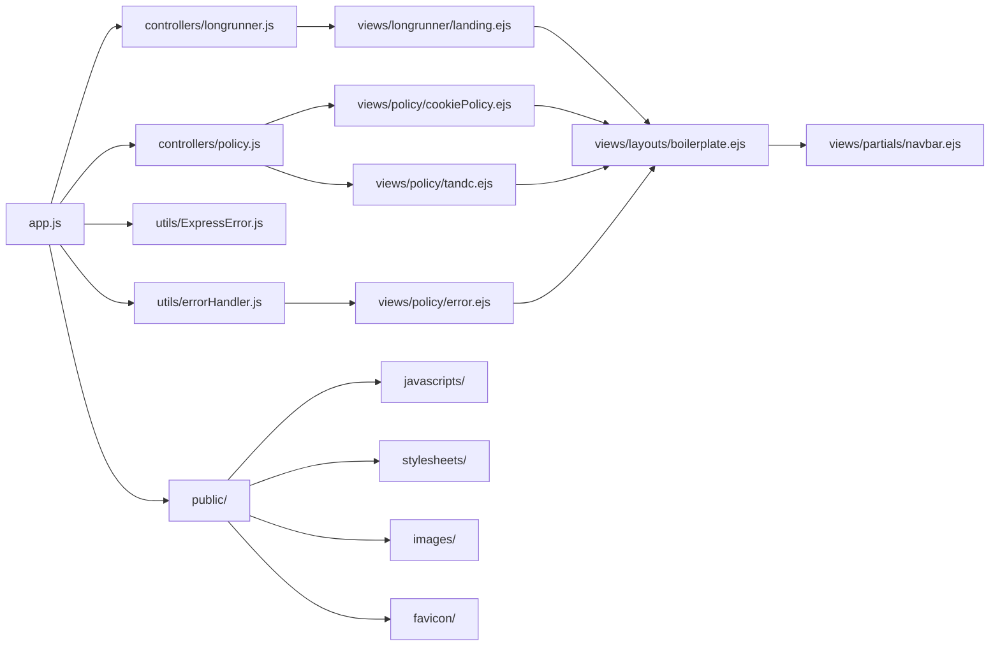

# Architecture Reference - Longrunner Landing App

## System Overview

The Longrunner Landing App is a simple, static web application built with Node.js and Express that serves as a central hub for accessing other web applications in the longrunner ecosystem. The application provides a clean landing page with links to the Shopping List App (slapp.longrunner.co.uk) and Quiz App (quiz.longrunner.co.uk), along with essential policy pages for legal compliance.

**Main Components:**

- Express.js server with EJS templating
- Static asset serving (CSS, JS, images)
- Policy page management (Cookie Policy, Terms & Conditions)
- Error handling system
- Security middleware (Helmet.js)

## Architecture Flow

## File/Module Inventory

### Core Application Files

#### `app.js` - Main Application Entry Point

- **Purpose**: Express server setup and configuration
- **Key Responsibilities**:
  - Middleware configuration (Helmet, body parsing, static files)
  - Route registration
  - Environment-based security settings
  - Server initialization (port 3000)
- **Main Functions**: Server startup, middleware setup, route binding

#### `package.json` - Dependencies & Scripts

- **Purpose**: Project metadata and dependency management
- **Key Dependencies**: Express, EJS, Helmet, serve-favicon
- **Scripts**: `npm run lint`, `npm run lint:fix`

### Controllers Directory

#### `controllers/longrunner.js` - Landing Page Controller

- **Purpose**: Handle landing page requests
- **Key Responsibilities**: Render main landing page
- **Main Exports**: `landing(req, res)` - renders longrunner/landing.ejs

#### `controllers/policy.js` - Policy Pages Controller

- **Purpose**: Handle policy page requests
- **Key Responsibilities**: Render cookie policy and terms & conditions pages
- **Main Exports**:
  - `cookiePolicy(req, res)` - renders policy/cookiePolicy.ejs
  - `tandc(req, res)` - renders policy/tandc.ejs

### Utils Directory

#### `utils/ExpressError.js` - Custom Error Class

- **Purpose**: Custom error handling for Express
- **Key Responsibilities**: Create structured error objects with status codes
- **Main Exports**: ExpressError class with message and statusCode properties

#### `utils/errorHandler.js` - Global Error Handler

- **Purpose**: Centralized error handling middleware
- **Key Responsibilities**: Render error pages with proper status codes
- **Main Exports**: `errorHandler(err, req, res)` - renders policy/error.ejs

### Views Directory

#### `views/layouts/boilerplate.ejs` - Base Layout Template

- **Purpose**: Main HTML layout with common elements
- **Key Responsibilities**:
  - HTML structure and meta tags
  - CSS/JS asset inclusion
  - Cookie alert integration
  - Bootstrap and FontAwesome integration

#### `views/longrunner/landing.ejs` - Landing Page Content

- **Purpose**: Main landing page content
- **Key Responsibilities**: Display app links and descriptions

#### `views/policy/` - Policy Page Templates

- **cookiePolicy.ejs**: Comprehensive cookie policy with third-party service details
- \*\*tandc.ejs`: Terms and conditions with legal disclaimers
- \*\*error.ejs`: Error page with stack trace (development only)

#### `views/partials/navbar.ejs` - Navigation Footer

- **Purpose**: Footer navigation with policy links
- **Key Responsibilities**: Provide navigation to policy pages

### Public Assets Directory

#### `public/javascripts/`

- `boilerplate.js`: Cookie consent management using localStorage
- `longrunnerLanding.js`: Empty (placeholder for future functionality)
- `cookiePolicy.js`: Empty (placeholder)
- `tandc.js`: Empty (placeholder)

#### `public/stylesheets/`

- `boilerplate.css`: Global styles and layout
- `longrunnerLanding.css`: Landing page specific styles
- `cookiePolicy.css`: Cookie policy page styles
- `tandc.css`: Terms & conditions page styles

#### `public/images/`

- `BackGround.jpg`: Background image
- `slapp.png`: Shopping List App icon
- `quiz.png`: Quiz App icon

#### `public/favicon/`

- Standard favicon set for different platforms and sizes

## Dependency Map

### Core Dependencies

- **Express.js**: Web framework and routing
- **EJS**: Template engine for server-side rendering
- **Helmet.js**: Security middleware for HTTP headers
- **serve-favicon**: Favicon serving middleware
- **ejs-mate**: EJS layout engine support

### Entry Points

- **Primary**: `app.js` - Server startup and configuration
- **Routes**: `/` (landing), `/policy/cookie-policy`, `/policy/tandc`

## Data Flow

### Request Flow

1. **User Request** → Express.js receives HTTP request
2. **Route Matching** → App.js matches URL to route handler
3. **Controller Execution** → Controller function processes request
4. **View Rendering** → EJS template rendered with data
5. **Layout Application** → Boilerplate layout wraps content
6. **Response** → HTML sent to client with static assets

### Static Asset Flow

1. **Asset Request** → Express static middleware serves from `/public`
2. **CSS/JS Delivery** → Browser receives styling and functionality
3. **Image Loading** → Icons and images displayed
4. **Favicon** → Browser tab icon set

### Cookie Consent Flow

1. **Page Load** → Boilerplate.js checks localStorage for `hasVisited`
2. **Alert Display** → Cookie alert shown if first visit
3. **User Action** → Click sets `hasVisited = true` in localStorage
4. **Persistence** → Future visits hide the alert

## Key Interactions

### Landing Page Flow

- **Route**: `GET /` → `controllers/longrunner.js:landing()`
- **Template**: `views/longrunner/landing.ejs` with `views/layouts/boilerplate.ejs`
- **Assets**: `longrunnerLanding.css`, `boilerplate.js`, app icons

### Policy Page Flow

- **Cookie Policy**: `GET /policy/cookie-policy` → `controllers/policy.js:cookiePolicy()`
- **Terms & Conditions**: `GET /policy/tandc` → `controllers/policy.js:tandc()`
- **Error Handling**: Any error → `utils/errorHandler.js:errorHandler()`

### Security Integration

- **Helmet.js**: Configures CSP headers differently for production/development
- **CSP Directives**: Allows specific CDN domains for Bootstrap, FontAwesome, Google APIs
- **Environment Detection**: Production uses stricter security policies

## Extension Points

### Adding New Pages

1. **Controller**: Create new function in appropriate controller file
2. **Route**: Add route in `app.js`
3. **View**: Create EJS template in `views/` directory
4. **Assets**: Add CSS/JS files if needed
5. **Navigation**: Update `views/partials/navbar.ejs` if needed

### Adding New Applications

1. **Update Landing**: Modify `views/longrunner/landing.ejs` with new app link
2. **Add Icon**: Place app icon in `public/images/`
3. **Update Styles**: Modify `longrunnerLanding.css` if needed
4. **Update Meta**: Update keywords and description in `boilerplate.ejs`

### Security Enhancements

1. **CSP Updates**: Modify scriptSrcUrls, styleSrcUrls arrays in `app.js`
2. **New Middleware**: Add security middleware before route definitions
3. **Environment Config**: Extend `configureHelmet()` function for new environments

### Static Asset Management

1. **New CSS**: Add to `public/stylesheets/` and reference in boilerplate
2. **New JavaScript**: Add to `public/javascripts/` and reference in boilerplate
3. **New Images**: Add to `public/images/` and reference in templates

### Policy Updates

1. **Cookie Policy**: Update `views/policy/cookiePolicy.ejs` for new services
2. **Terms & Conditions**: Modify `views/policy/tandc.ejs` for legal changes
3. **New Policies**: Create new policy templates and add routes/controllers

This architecture provides a solid foundation for a simple landing page with room for growth while maintaining security best practices and clean code organization.
